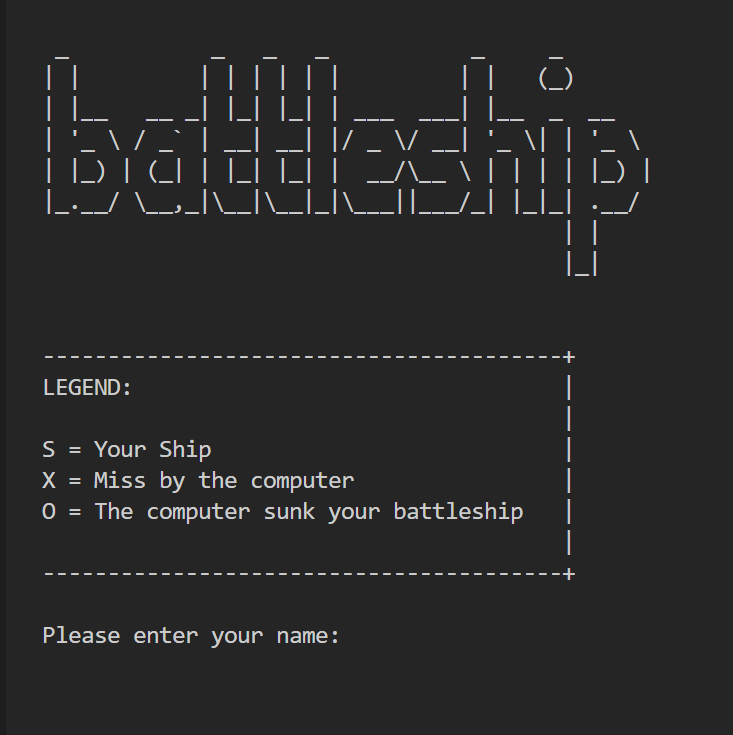
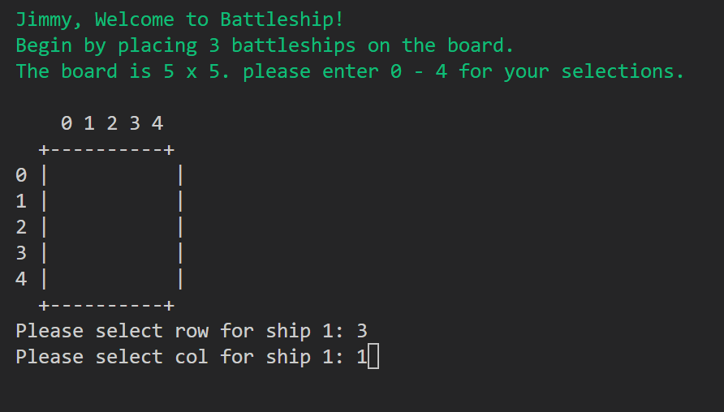
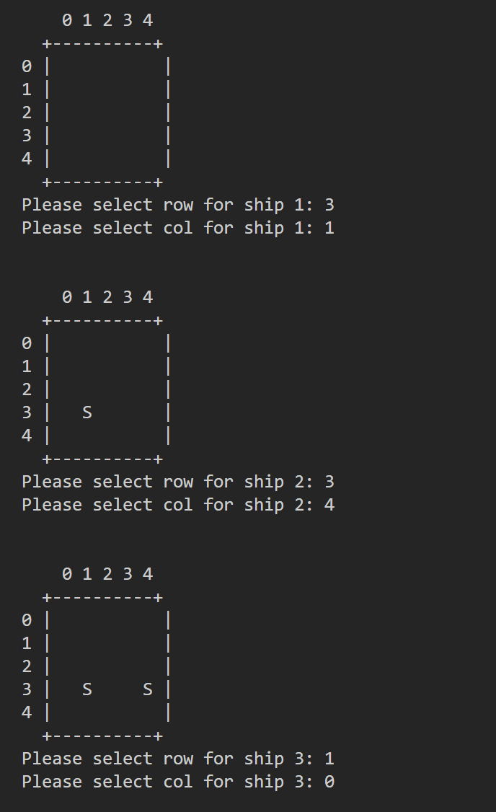
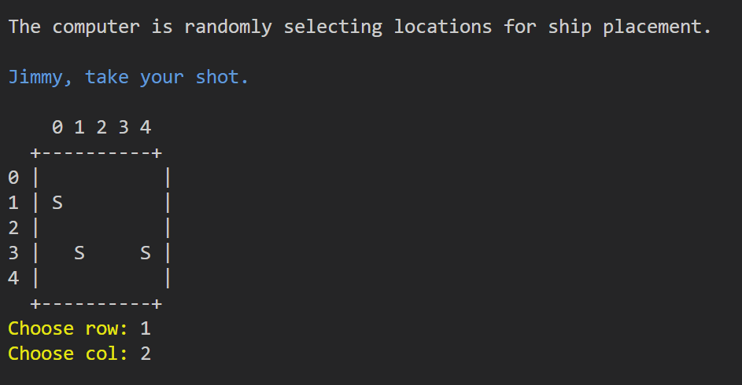
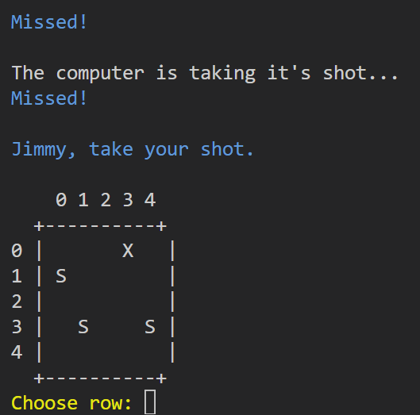
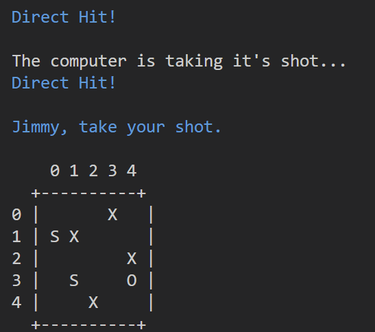
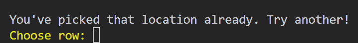
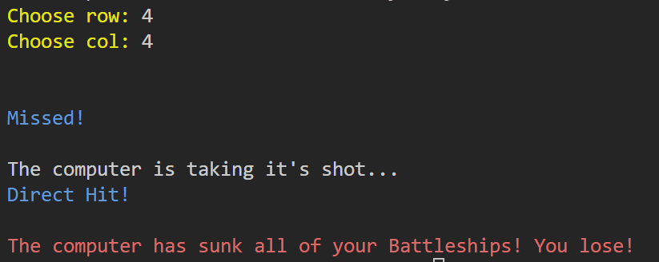

# Battleship

This is a Battleship game written in python, the game runs in the terminal. You can see it in action in the Code Institute mock terminal Heroku.

The user attempts to defeat the computer by sinking it's battleships and in turn, the computer attempts to sink the users's ships. In this version of the game, the user and the computer share the same board. To begin with, the user is asked to input their name and then asked to place three ships on the board.

You can read more about the game origin and other facts here [Battleship Wikipedia](https://en.wikipedia.org/wiki/Battleship_(game))

[The live version of the project can be seen here](https://ci-battleship-pp3.herokuapp.com/)

## Features

- The title "battleship" is displayed when the game runs. 
- A legend is also displayed to show the user what each character represents. 
- An input asking the user for their name is also displayed.

- A welcome message containing the users name is displayed.
- The user is asked to begin by placing 3 ships on the board.
- The user is also told that the game area / board is 5 rows x 5 columns.
- It is also explained how to place user ships on the board by selecting digits from 0 to 4.

- The user makes their selections by first selecting a row, and then a column.
- They do this 3 times. Once per ship. An 'S' is displayed on the board to represent the player's ship.

- Next the computer randomly selects 3 locations on the board for it's ships. The computer's ships are not visible to the player.
- The game can now begin and the user is encouraged to take the first shot.
- Users take shots by first selecting a row number followed by a column number.

- The user is told if their shot was a hit or a miss.
- The computer then takes a shot and the user is informed if it hit or missed.
- Failed efforts by the computer are represented on the board by an 'X'.
- Then the game loop continues.

- With this shot both the player and computer sink a battleship!
- The 'O' on the board tells the user that one of their ships has been sunk.

- If the user fires at a location that they previous selected, they are promted to choose again.

- Here, the computer sunk all the users ships so the game is lost.

- Here the user wins. At the end of the game the user is given a choice to play again.

## Future Features

- Have a scoreboard displayed to track and show the current score.
- Allow the user to select board size and number of ships.
- Create ships that take up more spaces on the board, currently they are 1x1.

## Data Model

## Testing

I have performed manual testing on this project:

- I used the PEP8 linter to verify that there are no errors in my code.
- I purposely entered invalid inputs to ensure data validation was working.
- Tested the project in my local and terminal as well as the Code Institute Heroku terminal.

## Bugs

- The break statement in the game loop did not work when the user won the game. This was due to an indentation issue. Correcting the indentation resolved the issue.
- After deployment to Heroku, termcolor was not having any affect. I had forgotten to update my requirements file. typing `pip3 freeze > requirements.txt` in the terminal resolved the issue.

## Remaining Bugs

- No remaining bugs that I can find.

## Deployment

This project was deployed using Code Institute's mock terminal for Heroku.

- Deploymetn steps:
   - Fork or clone this repository.
   - Create a new Heroku app.
   - Set the buildpacks to Python & NodeJS in that order.
   - Link the Heroku app to the repository.
   - Click on Deploy.

## Credits

- The ASCII art used for the title of the game was taken from [ascii.co.uk](https://ascii.co.uk/art/battleship).
- Code Institute for allowing me use of their deployment terminal.
