# Battleship

This is a Battleship game written in python, the game runs in the terminal. This program is a simple text-based implementation of the popular game. You can see it in action in the Code Institute mock terminal Heroku.

The user attempts to defeat the computer by sinking it's battleships and in turn, the computer attempts to sink the users's ships. In this version of the game, the user and the computer share the same 5x5 grid board. To begin with, the user is asked to input their name and then, to place three ships on the board.

The computer marks the board with an 'X' if it misses a shot. The game is coded to ensure that the computer does not shoot at or mark locations already containing a computer ship. Therefore the user can be confident that squares marked 'X' do not contain ships. If the user selects a square marked 'X', they are given another try.

When the user finds a computer ship, '@' is marked on the board to indicate that the computer ship has been sunk.

You can read more about the game origin and other facts here [Battleship Wikipedia](https://en.wikipedia.org/wiki/Battleship_(game))

[The live version of the project can be seen here](https://ci-battleship-pp3.herokuapp.com/)

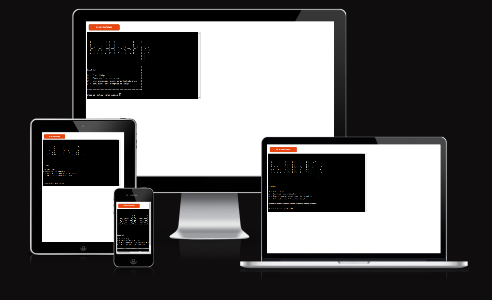

## Features

- The title "battleship" is displayed when the game runs. 
- A legend is also displayed to show the user what each character represents. 
- An input asking the user for their name is also displayed. This input cannot be left blank and must have a minimum of three characters.

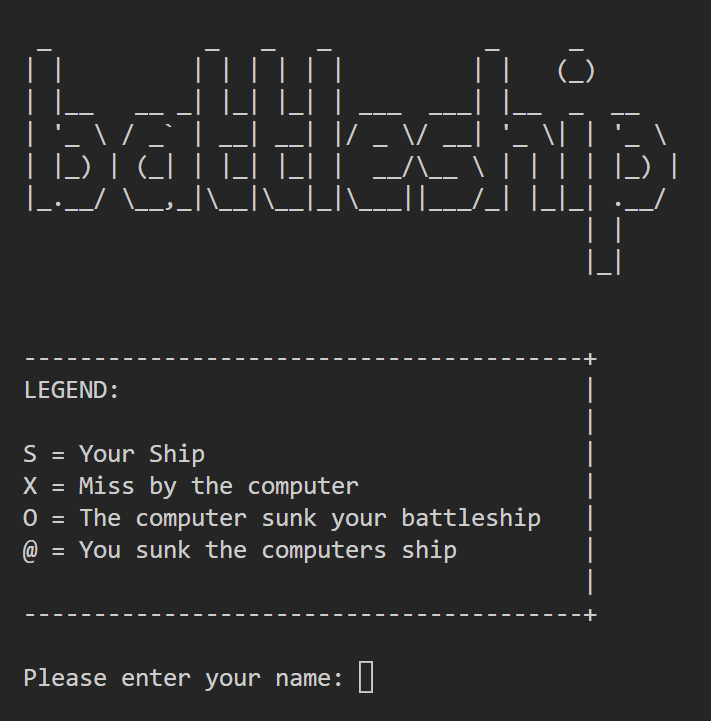

- A welcome message containing the user's name is displayed.
- The user is asked to begin by placing 3 ships on the board.
- The user is also told that the game area / board is 5 rows x 5 columns.
- It is also explained how to place user ships on the board by selecting digits from 0 to 4.

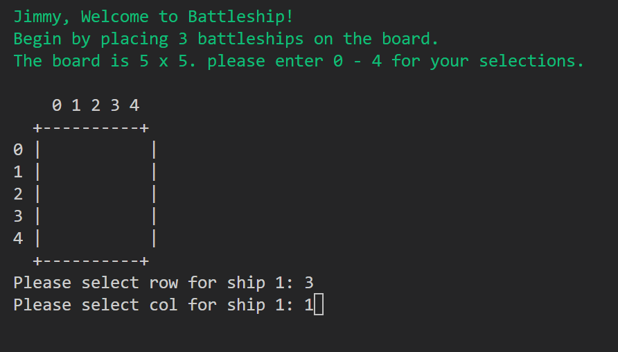

- The user makes their selections by first selecting a row, and then a column. Validation is in place to make sure that only locations contained in the game area are permitted.
- They do this 3 times. Once per ship. An 'S' is displayed on the board to represent the player's ship.

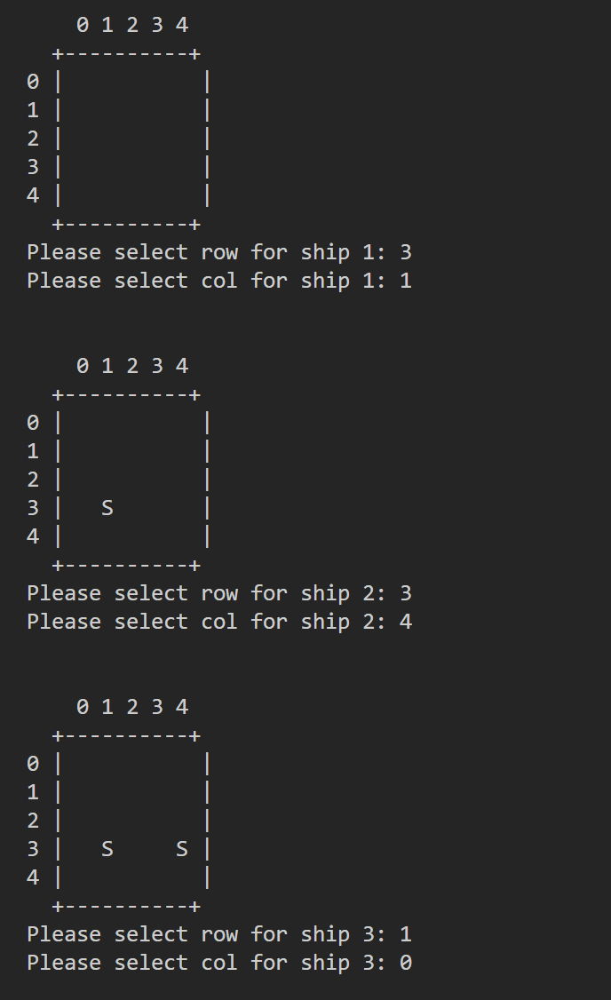

- Next the computer randomly selects 3 locations on the board for it's ships. The computer's ships are not visible to the player. Also it cannot choose locations already containing user ships.
- The game can now begin and the user is encouraged to take the first shot. Validation is in place to only allow shots to be fired at squares within the game area.
- Users take shots by first selecting a row number followed by a column number.

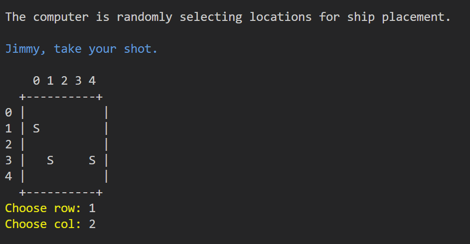

- The user is told if their shot was a hit or a miss.
- The computer then takes a shot and the user is informed if it hit or missed. The computer cannot fire on locations containing its own ships.
- Failed efforts by the computer are represented on the board by an 'X'.
- Then the game loop continues.

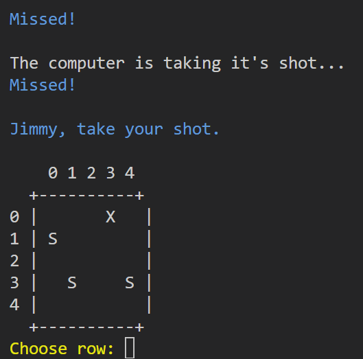

- With this shot both the player and computer sink a battleship!
- The 'O' on the board tells the user that one of their ships has been sunk.
- The '@' on the board tells the user that they have sunk one of the computer ships.

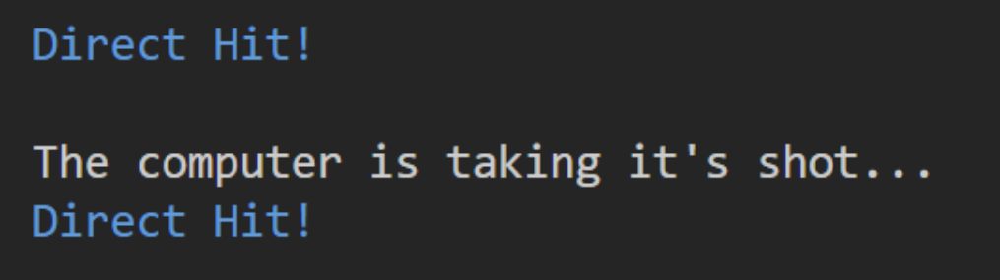
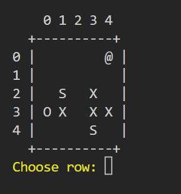

- If the user fires at a location containing an 'X' or one of their own ships, they are prompted to choose again.

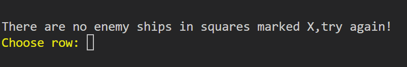

- Here, the computer sank all the users ships so the game is lost.

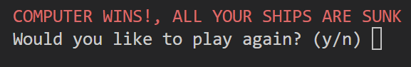

- Here the user wins. At the end of the game the user is given a choice to play again.

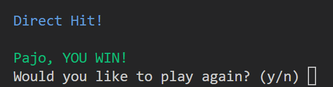

- If the user selects no, the screen is cleared and the title is shown along with a message "Thanks for playing!".

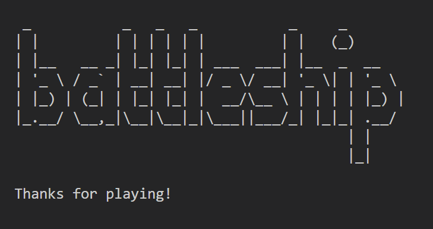

## Future Features

- Have a scoreboard displayed to track and show the current score.
- Allow the user to select board size and number of ships.
- Create ships that take up more spaces on the board, currently they are 1x1.
- Allow the user to select the difficulty level.

## Data Model

- The `game_setup()` function asks the user to place 3 ships on the board. It also places 3 ships on the board for the computer. If the user input is invalid, i.e. a string or a location outside of the board, the user is prompted to select again.
- The `display_board()` function iterates over all of the squares in the game area and prints them out.
- The `eliminate_target()` function tries to find targets in the game area. If it finds ‘S’, representing a user ship, it changes it to ‘O’, indicating the user’s ship is sunk. If it finds an empty square an ‘X’ is printed to that square showing that the computer missed.
- The `game_loop()` function asks the user to pick a location on the board and then the computer takes a random guess. The function checks to see if the user input is valid, if not they are asked to re-enter their input. The loop continues until either the user or computer sinks their opponents’ ships.
- The `play_game()` function is the main function. It calls all the main functions containing the game code.

## Testing

I have performed manual testing on this project:

- I used the PEP8 linter to verify that there are no errors in my code.
- I purposely entered invalid inputs to ensure data validation was working.
- Tested the project in my local terminal as well as the Code Institute Heroku terminal.
- I tested the CI Terminal in Chrome, FireFox, Edge & Safari browsers, the app runs well in all without any noticable differences.

During testing I added code to the `game_setup()` function which marked the computer ships on the board with an '?'. This was just for testing purposes to quickly see the outcome of winning or losing a game.

    Marking the computer's ships on the board
    `for row in range(GAME_AREA):
        for col in range(GAME_AREA):
            if pc_board[row][col] == 'S':
                user_board[row][col] = '?'`

This code has been removed from the deployed project.

## Bugs

- The break statement in the game loop did not work when the user won the game. This was due to an indentation issue. Correcting the indentation resolved the issue.
- After deployment to Heroku, termcolor was not having any affect. I had forgotten to update my requirements file. typing `pip3 freeze > requirements.txt` in the terminal resolved the issue.

## Remaining Bugs

- No remaining bugs that I can find.

## Deployment

This project was deployed using Code Institute's mock terminal for Heroku.

- Deployment steps:
   - Fork or clone this repository.
   - Create a new Heroku app, the app must have an unique name.
   - Set the buildpacks to Python & NodeJS in that order.
   - Link the Heroku app to the GitHub repository.
   - Click on Deploy.
   - You have the option in Heroku to enable automatic deployment, changes made locally that are pushed to GitHub are then re-deployed in Heroku.

## Credits

- The ASCII art used for the title of the game was taken from [ascii.co.uk](https://ascii.co.uk/art/battleship).
- Code Institute for allowing me the use of their deployment terminal.
- Wikipedia for information about the battleship game.
